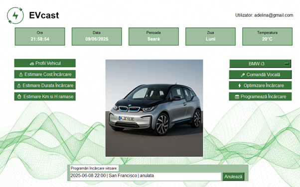

# 🚗 EVcast: Intelligent Prediction and Optimization System for Electric Vehicles

## 📘 Overview

EVcast is a smart desktop application designed to enhance the experience of electric vehicle (EV) users by predicting key metrics such as charging duration, cost, and remaining autonomy. Built using Python and Tkinter, and powered by machine learning algorithms, EVcast integrates voice recognition and Firebase services to deliver a seamless, interactive user experience.
## 

## 🎯 Project Motivation

With the global shift toward sustainable transportation and the rapid growth of EV adoption, efficient energy management and user-friendly tools are essential. EVcast addresses challenges like chaotic energy consumption and lack of intelligent scheduling by offering predictive insights and automation through AI.

## 🧠 Key Features

- 🔍 Predictive models for:
  - Charging duration
  - Charging cost
  - Remaining autonomy
- 🗣️ Voice-controlled agent using Whisper for natural interaction
- 🔐 Firebase Authentication for secure user access
- 📊 Realtime Database integration for dynamic data storage
- 🖥️ GUI built with Tkinter for intuitive navigation
- 📈 Feature engineering and ML pipeline for enhanced model accuracy
- 📍 Smart scheduling of charging sessions based on historical data and cost optimization

## 🛠️ Technologies Used

| Component              | Technology                     |
|------------------------|--------------------------------|
| GUI                    | Tkinter                        |
| ML Models              | RandomForestRegressor, MLPRegressor, Keras Sequential |
| Optimization           | Grid Search, Genetic Algorithms |
| Voice Recognition      | Whisper (OpenAI)               |
| Database               | Firebase Realtime Database     |
| Authentication         | Firebase Authentication        |
| Data Preprocessing     | Scikit-learn                   |
| Visualization          | Seaborn                        |

## 🧪 Machine Learning Pipeline

1. **Data Collection**: Kaggle dataset with 1320 samples covering EV specs, charging behavior, and user demographics.
2. **Preprocessing**: Handling missing values, normalization, One-Hot Encoding.
3. **Feature Engineering**: Derived features like Charging Efficiency, Temperature Adjusted Consumption.
4. **Correlation Analysis**: Identifying key predictors for model training.
5. **Model Training**: Split into training and test sets using `train_test_split`.
6. **Hyperparameter Tuning**: Compared Grid Search vs Genetic Algorithms.
7. **Evaluation**: Metrics like R² and MSE used to assess model performance.

## 🧩 Application Architecture

- Modular design with object-oriented principles
- UML diagrams for class relationships and component interactions
- Core modules:
  - `UserSigning`: Manages authentication
  - `MenuInterface`: Central hub for navigation
  - `ChargingDuration`, `ChargingCost`, `Estimare_Km_h`: ML-powered estimators
  - `VehicleProfile`: Stores user vehicle data
  - `SpeechRecognition`: Voice input and command processing

## 🚀 Future Enhancements

- 📍 GPS integration for dynamic location-based predictions
- 🧠 Persistent memory for the voice agent (ChatBot-like behavior)
- 📱 Mobile version of the application
- 🔄 Real-time model updates based on new user data

## 📌 Limitations

- Static models post-training (no live updates)
- Predefined locations in dataset (USA-based)
- Basic voice agent without adaptive learning
- Desktop-only interface optimized for vehicle tablets

## 📂 How to Run

1. Clone the repository
2. Install dependencies (`pip install -r requirements.txt`)
3. Configure Firebase credentials
4. Run the main application script (`python main.py`)

## 📄 License

This project is part of a Bachelor's thesis at Universitatea „1 Decembrie 1918” din Alba Iulia, Faculty of Informatics and Engineering.

---

Would you like help turning this into a GitHub page or adding setup instructions for Firebase and Whisper?
